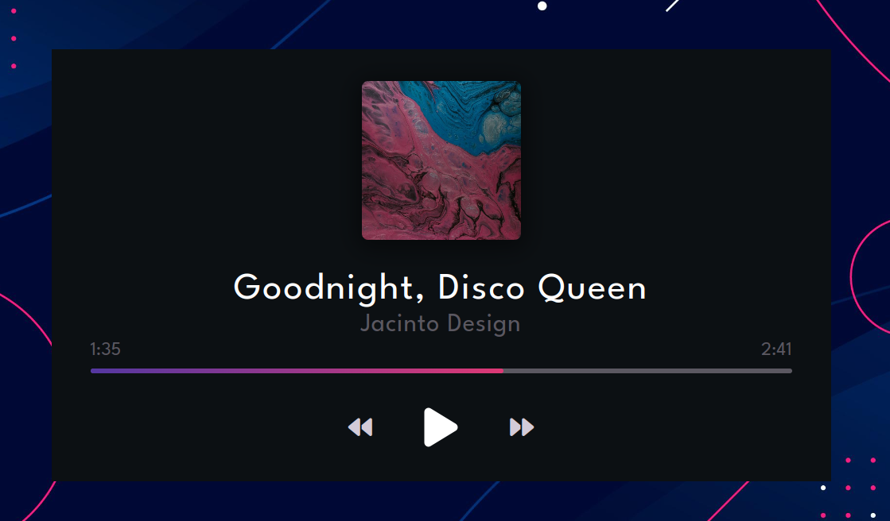

# Music Player

Create a Music Player using HTML, CSS and JS. It will show Album art, Title, Artist, Current Time and Duration of the song. It will also have playback controls like Play, Previous and Next.

Live - https://overdrivemachines.github.io/music-player/

## References

- HTML Audio/Video DOM - https://www.w3schools.com/tags/ref_av_dom.asp
- Destructuring assignment - https://developer.mozilla.org/en-US/docs/Web/JavaScript/Reference/Operators/Destructuring_assignment
- Styling
  - Inspiration - https://www.behance.net/gallery/64083009/Toyota-media-system-interface
  - Perfect Full Page Background - https://css-tricks.com/perfect-full-page-background-image/
  - My Codepen - https://codepen.io/overdrivemachines/pen/yLjLYwy
